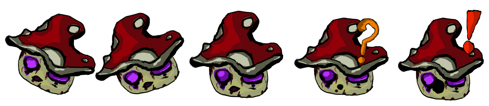

# Rem and the corrupt world (Global Game Jam 2023)

Global Game Jam page of the game : [Rem and the corrupt world (Global Game Jam 2023)](https://globalgamejam.org/2023/games/talence-game-jam-2023-1)

## Context

 

The GGJ is the world's largest game creation event taking place around the globe boasting tens of thousands of participants (jammers) at hundreds of physical and virtual sites in over one hundred countries around the world.

In the 2023 GGJ Edition, we had from Friday 3rd Frebuary 7:00PM to Sunday 5th Frebuary 8:00PM for create a game on the theme : "Roots".

<iframe width="560" height="315" src="https://www.youtube.com/embed/G8vZDKQWH68" title="YouTube video player" frameborder="0" allow="accelerometer; autoplay; clipboard-write; encrypted-media; gyroscope; picture-in-picture; web-share" allowfullscreen></iframe>

And optionally we can also add constrainsts (called "Diversifiers") to the developpement of the game. You can find the complete list [here](https://globalgamejam.org/news/ggj-2023-diversifiers).

**More informations on the [Global Game Jam Website](https://globalgamejam.org/news/theme-global-game-jam-2023)**

## Description
Rem and the corrupt world is a puzzle game created with unity during the Global Game Jam 2023 where you play a Treant who is Rem. You need to avoid ennemies with your capacity to be a real bush (she think she is a bush so she is a bush) to finally reach the end of the level.

We think that our game complete the "Proximity effect" Diversifier because we made all the sounds with things we had on us (yes one of our members came with a guitar).

## Screenshots
| |
|:--:|
| **Title Screen**|

| |
|:--:|
| **Level 1 - beginning**|

| |
|:--:|
| **Level 1 - Hide Feature**|

| |
|:--:|
| **Level 2 - Grow a plant to climb up**|

| |
|:--:|
| **End Game Artwork when you finish the game**|

|  |
|:--:|
| **Ennemies sprite (Mushroom and Mosquito)**|

## Contributors
- ANEAS Alan (Developper)
- BLOUIN Lukas (Developper)
- KATTAN Taleiven (Developper)
- MARTIN Charles (Developper)
- LIMOUSY Lilian (Illustration and Sound Design)
- MOCCATTI Alicia (Level and Sound Design)
- PEREIRA Alexis (Illustration and Sound Design)
